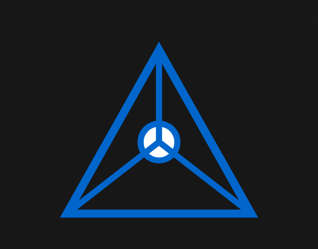

<!-- 배너 -->

---

## 👋 소개
안녕하세요! 프론트엔드/AI 분야에 관심이 많은 개발자 **조진경**입니다.  
작게는 HTML/CSS/JS로 만드는 인터랙티브 웹, 크게는 AI 데모와 로봇 프로젝트까지 **보이는 결과물**에 집중합니다.  
- GitHub: https://github.com/susie1214  
- Contact: susie121428@gmail.com / (https://m.blog.naver.com/hahaha067)

---

## 🧰 기술 스택

<table>
  <tr>
    <td>
      <h3>언어</h3>
      

        
        
        
      

    </td>
    <td>
      <h3>프레임워크 & 라이브러리</h3>
      

        
      

    </td>
  </tr>
  <tr>
    <td>
      <h3>도구</h3>
      

        
        
        
      

    </td>
    <td>
      <h3>배포 & 기타</h3>
      

        
        
      

    </td>
  </tr>
</table>

---

## 🧩 대표 프로젝트

<table>
  <tr>
    <td width="30%">
      <!-- 미리보기 GIF가 있으면 assets/mario.gif 로 추가 -->
      
    </td>
    <td>
      <h3>ICT Project</h3>
      
실시간 멀티모델 분류 기반 델타 로봇 피킹 시스템

      

        
        <!-- 데모를 깃헙 페이지에 배포하면 아래 링크 주석 해제 -->
        <!--  -->
      

    </td>
  </tr>
</table>

---

## 📦 로컬 실행 (예시)
